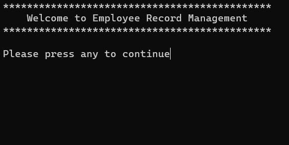

# Employee Record Management System in C++


## Overview

Welcome to the **Employee Record Management System in C++**! This console-based program allows you to input employee information and store it in a file structure for persistent data storage.

## Features

- **Employee Information Input:**
  - Collects information such as name, ID, position, and salary for two employees.
  - Stores the entered employee records in a file for future reference.

## Demo



## Usage

1. Clone the repository:

    ```bash
    git clone https://github.com/iMamoonAkhter/Employee-Record-Management-System-C-.git
    ```

2. Compile and run the program:

    ```bash
    g++ main.cpp -o employee_management
    ./employee_management
    ```

3. Follow the on-screen instructions to input employee information.

## Requirements

- C++ compiler
- System that supports the `system("cls")` command (Windows) or equivalent for clearing the console screen.

## Contribution

Contributions are welcome! If you have suggestions or improvements, feel free to create an issue or submit a pull request.

## Demo Screenshot


## License

This project is licensed under the [MIT License](LICENSE).

---

**Note:** Replace "iMamoonAkhter" with your GitHub username in the clone URL.
